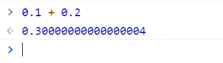
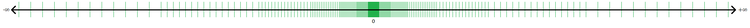
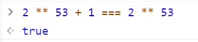

# 神奇的 `0.30000000000000004`

如果在浏览器控制台中执行 `0.1 + 0.2`，你会发现惊奇 😮 地发现运行结果并不是 0.3，而是 `0.30000000000000004` ⁉︎：



你没有看错，而且这不是浏览器的问题，也不是 JavaScript 语言的问题，`0.30000000000000004` 问题在很多语言包括 C/C++，Python 中都存在，因此还有一个以此为域名的站点：https://0.30000000000000004.com/ ，这个问题其实是跟计算机 🖥 处理小数的机制有关。

## 浮点格式

我们知道，计算机作为一个二进制系统，是可以天然地支持整数的存储的（当然受限于存储位数，存在值范围）。但是如果想要完美支持小数的话，则需要计算机能做到连续和无限 ♾︎，这对于一个硬件系统是不可能实现的。也就是说，计算机硬件在小数的处理上，天然地就是存在精确问题的 🤷‍♂。



在计算机科学中，一般用**浮点数**表示小数，用下面的表示法表示的数，就称为浮点数，其中包括三个部分：

- 有效数字（Significand）或尾数（Mantissa）
- 基数（Base）
- 指数（Exponent）


这种表示方式类似我们熟悉的科学计数法。之所以称之为浮点数，是因为有效数字中的小数点位置，是随着指数的变化而浮动的，比如：123.45 = 12345 × 10<sup>−2</sup> = 1.2345 × 10<sup>2</sup>。

## 计算机如何处理浮点数

[IEEE 754 标准](https://zh.wikipedia.org/wiki/IEEE_754) 是计算机浮点数处理的主流标准，其中定义了包括单精确度（32 位）和双精确度（64 位）等四种类型的浮点数值的二进制格式。JavaScript 的 `Number` 类型就是一个双精度 64 位 IEEE 754 标准的类型。其存储在计算机中的二进制数据格式如下：


其中包括：

- 符号位（Sign）：1 位，0 表示正，1 表示负
- 指数（Exponent）：11 位，使用的是偏移二进制（移码）表示（偏移值位 -1023，即指数值 1023 表示实际值 0）
- 有效数字（Significand precision）：53 位，因为第一位固定为 1 不用存储，实际存储 52 位的尾数（Fraction）部分

即一个 64 位双精度数的值可以表示为下面表达式：


有效数字的尾数决定了浮点数的精度，所以 JavaScript 中的最大安全整数数 `Number.MAX_SAFE_INTEGER` === 9007199254740991 === `2 ** 53 - 1`，超过该数字，就可能会出现精度问题，比如：



11 位的指数位决定了允许表示的浮点数的值在 1.79E+308（2<sup>1024</sup>，即 `Number.MAX_VALUE`） 和 1.79E-308（-2<sup>1024</sup>） 之间。而通过精度调整，可以取到的最小非零整数 `Number.MIN_VALUE` 为 5E-324。

## 浮点数二进制格式转换

十进制到 64 位浮点数的转换步骤，以十进制数 13.25 为例：

1. 整数部分转换为二进制数：13<sub>(10)</sub> = 1101<sub>(2)</sub>
2. 小数部分转换为二进制数：0.25<sub>(10)</sub> = 0.01<sub>(2)</sub>
3. 合并两部分二进制数：13.25<sub>(10)</sub> = 1101.01<sub>(2)</sub>
4. 进行规格化表示（即保留一位小数）：1101.01<sub>(2)</sub> = 1.10101<sub>(2)</sub> x 2<sup>3</sup>
5. 指数部分进行 11 位偏置码转换：3 + 2<sup>(11-1)</sup> -1 = 1026<sub>(10)</sub> = 100 0000 0010<sub>(2)</sub>
6. 规范化尾数（补齐尾数位数到 52，因为所有规范化浮点数，都是整数部分都是 1，所以不需要存储）：1.10101 = <span style="text-decoration: line-through">1.</span>1010 1000 0000 0000 0000 0000 0000 0000 0000 0000 0000 0000 0000
7. 合并浮点数三部分二进制值：

   1. 符号位（0 表示正，1 表示负）：0
   2. 指数：100 0000 0010
   3. 尾数：1010 1000 0000 0000 0000 0000 0000 0000 0000 0000 0000 0000 0000

   得到最后的结果为 `0 10000000010 1010100000000000000000000000000000000000000000000000`

## 为什么是 `0.30000000000000004`

浮点数实际计算过程中，涉及到对阶、溢出、精度取舍等细节。我们这里就不深究了。我们只要记住浮点数在存储和运算的过程中都可能存在误差即可。
下面简单分析一下为什么 `0.1 + 0.2` 为什么等于 `0.30000000000000004`。

```js
// 0.1 和 0.2 的二进制格式如下：
(0.1).toString(2) ===
  "0.0001100110011001100110011001100110011001100110011001101";
(0.2).toString(2) ===
  "0.001100110011001100110011001100110011001100110011001101";

// 对尾数部分进行二进制的计算可以得到: 0100110011001100110011001100110011001100110011001101
// 整好就是 0.3000000000000000 的二进制尾数部分
(0.30000000000000004).toString(2) ===
  "0.0100110011001100110011001100110011001100110011001101";
```

## 那我们怎么处理

既然计算机没法避免误差的问题，那么我们是不是就没法对小数进行准确的计算了呢？当然不是的，虽然硬件层面不支持，但是我们还是可以通过软件层面的转换进行。一般的思路是：

- 将小数转成整数（不过整数也存在值范围）
- 将数字转成字符串，再实现运算逻辑

当然啦，实际开发中，借助现有的库进行处理就好了，比如 (decimal.js)[https://github.com/MikeMcl/decimal.js/]、(bignumber.js)[https://github.com/MikeMcl/bignumber.js] 等

## 参考

- [Double-precision floating-point format](https://en.wikipedia.org/wiki/Double-precision_floating-point_format)
- [NDN: Number](https://developer.mozilla.org/en-US/docs/Web/JavaScript/Reference/Global_Objects/Number)
- [Converter to 64 Bit Double Precision IEEE 754 Binary Floating Point Standard System:](https://binary-system.base-conversion.ro/convert-real-numbers-from-decimal-system-to-64bit-double-precision-IEEE754-binary-floating-point.php)

<!--  -->
