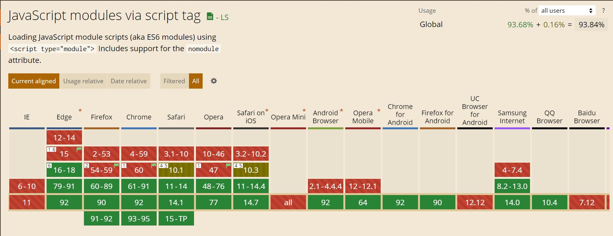
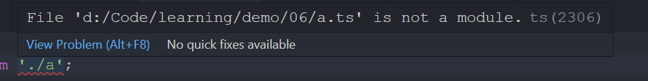
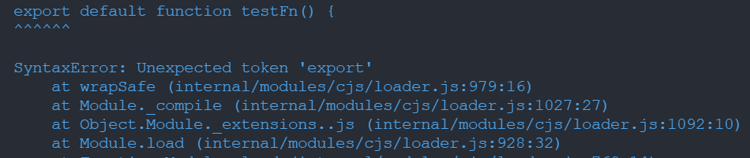

# 前端模块化

## 为什么需要模块化

在我们还在用 jQuery 写前端页面的时候，由于 Webpack、Babel 等构建工具还没出现，前端项目没有像现在这样实现工程化，我们不得不通过写如下的代码来组织脚本：

```html
<!-- ref: https://github.com/jquery/jquery-ui/blob/1.5.1/demos/functional/index.html -->

...
<script type="text/javascript" src="../../jquery-1.2.6.js"></script>
<script type="text/javascript" src="../../ui/ui.core.js"></script>
<script type="text/javascript" src="../../ui/ui.accordion.js"></script>
<script type="text/javascript" src="../../ui/ui.datepicker.js"></script>
<script type="text/javascript" src="../../ui/i18n/ui.datepicker-ar.js"></script>
<script type="text/javascript" src="../../ui/i18n/ui.datepicker-bg.js"></script>
<script type="text/javascript" src="../../ui/i18n/ui.datepicker-ca.js"></script>
<script type="text/javascript" src="../../ui/i18n/ui.datepicker-cs.js"></script>
<script type="text/javascript" src="../../ui/i18n/ui.datepicker-da.js"></script>
...
```

这样的方式，当然有很多缺点：

- 代码冗长，需要手写一堆的 `script` 标签
- 在 HTTP 1.0 网络协议上还有同域名请求 2-6 个最大并发数的限制，容易影响性能 🐢
- 需要通过脚本加载顺序保证各个脚本文件之间的依赖关系，如上面例子中 `jquery-1.2.6.js` 文件就必须放在其它文件之前
- 需要关心命名冲突的问题。为此，利用 JavaScript 闭包的原理，我们发明 💡 了 [`IIFE`（立即调用函数表达式）](https://developer.mozilla.org/zh-CN/docs/Glossary/IIFE)：

```js
(function () {
  statements;
})();
```

这种原始的开发模式，随着前端应用越来越大，变得日益地不可持续 📉，可维护性和代码可复用性都很差 😵，开发者急需模块化的开发方案。

## 模块化方案

模块化在开发领域一直是一个常见而重要的概念，像 C 或 Java 等服务端语言都是支持模块化的。但是在 ES6 之前的很长一段时间里 JavaScript 都没有模块化的相关标准，于是大家不得不自己寻找解决方案（前端领域一直都是标准落后于实现的 🤷‍♂）。目前常见的模块加载方案有：

- [CommonJs（或 cjs）](https://en.wikipedia.org/wiki/CommonJS)
- [AMD](https://github.com/amdjs/amdjs-api/wiki/AMD)
- [UMD](https://github.com/umdjs/umd)
- [ES Module](https://262.ecma-international.org/6.0/#sec-modules)
- [SystemJS](https://github.com/systemjs/systemjs#systemjs)

### CommonJs

[CommonJs](https://en.wikipedia.org/wiki/CommonJS) 或简写为 cjs，一开始命名为 ServerJS，而且从原来的名字就可以看出是针对服务端的模块化方案。**服务端和 web 端的一个主要区别就在与服务端的脚本都是本地的，没有异步加载的需求。**[Node.js](https://nodejs.org/api/modules.html#modules_modules_commonjs_modules) 的模块化就是基于该规范的实现，要点是：

- 一个文件就是一个模块
- 导出： `module.exports` 或其引用 `exports`
- 导入： `require`

```js
// a.js
exports.name = "jerryyxu";

// main.js
const { name } = require("a.js");
```

> 在 CommonJs 的规范中，并没有定义 `module.exports` 而只有 `exports`， 但是，大部分的实现包括 Node.js 都实现了 `module.exports`，这在 Webpack 中区分为 `commonjs2` 和 `commonjs`。（For more detail, [read this issue](https://github.com/webpack/webpack/issues/1114)）

### AMD

[AMD](https://github.com/amdjs/amdjs-api/wiki/AMD) 是 Asynchronous Module Definition （异步模块定义）的简写，跟 CommonJs 的主要区别就在于支持异步模块的加载，是针对 web 端的模块化方案。要点是：

- 模块定义： `define(id?, dependencies?, factory)`
- 模块引用：`require`

因为要支持异步，在不考虑 `await/async` 的情况下，模块的内容部分是需要放在 `factory` 这样一个回调函数中。

```js
define("a", ["require", "exports", "b"], function (require, exports, b) {
  exports.verb = function () {
    return b.verb();
    //Or:
    return require("b").verb();
  };
});
```

[RequireJs](https://requirejs.org/) 就是基于该方案的实现。只需要通过 `script` 标签引入 `require.js` 脚本，RequireJs 通过 `data-main` 属性获取脚本入口，并依次加载依赖。

```js
// Complete Code See: https://github.com/requirejs/example-jquery-shim
<script data-main="js/app" src="js/lib/require.js"></script>
```

### UMD

[UMD](https://github.com/umdjs/umd) 是 Universal Module Definition （通用模块定义的缩写），本身并不制定接口规范，而是提供了兼容 CommonJs 和 AMD 的方案。其实就是通过判断 `define` `exports` 等关键变量的判断选择是选择 AMD 还是 CommonJs 还是挂载到全局变量。

```js
(function (root, factory) {
  if (typeof define === "function" && define.amd) {
    // AMD
    define(["exports", "b"], factory);
  } else if (
    typeof exports === "object" &&
    typeof exports.nodeName !== "string"
  ) {
    // CommonJS
    factory(exports, require("b"));
  } else {
    // 暴露到全局
    factory((root.commonJsStrict = {}), root.b);
  }
})(typeof self !== "undefined" ? self : this, function (exports, b) {
  // Use b in some fashion.

  // attach properties to the exports object to define
  // the exported module properties.
  exports.action = function () {};
});
```

### ES Modules

无论是 CommonJs 还是 AMD 都是基于现有 JavaScript 能力的规范，而不是语法层面的支持。直到 2015 年，TC39 工作组才终于在 [ECMAScript 6](https://262.ecma-international.org/6.0/#sec-modules) 的标准中制定了模块化方案：

- 文件包含顶层 `import` 或 `export` 语句的即为模块：区别于 Node.js 的每个 JS 文件就是一个模块
- 导出：`export default ...` 或 `export ...`
- 导入：`import ... from ...`
- 通过标签：`<script type="module"></script>`
- 模块文件后缀：`.mjs`

```js
// a.js
export const name = "jerryyxu";

// main.js
import { name } from "a.js";
```

关于 ES Module 更多的知识点，建议访问 👀 [MDN: JavaScript modules](https://developer.mozilla.org/en-US/docs/Web/JavaScript/Guide/Modules)

### SystemJs

[SystemJs](https://github.com/systemjs/systemjs#systemjs) 是一个 `All-in-One` 式的通用模块加载器，区别于 UMM 只是为了兼容更多的模块化方案，SystemJs 的主要是目的将 ES modules 转换成 SystemJS 的模块格式，以便兼容 IE11 等比较老的浏览器。另外，SystemJS 还支持一些扩展功能：

- [动态 `import()`](https://github.com/tc39/proposal-dynamic-import)
- `import.meta`, 包括 `import.meta.url` and `import.meta.resolve`
- 支持顶层 await
- 实时绑定更新

```js
// 模块注册
System.register(["main.js"], function (_export, _context) {
  var dep;
  return {
    setters: [
      function (_dep) {
        dep = _dep;
      },
    ],
    execute: function () {
      _export({
        name: "value",
      });
    },
  };
});
```

```html
<script src="system.js"></script>
<script>
  // set our baseURL reference path
  System.config({
    baseURL: "/app",
    // or 'traceur' or 'typescript'
    transpiler: "babel",
    // or traceurOptions or typescriptOptions
    babelOptions: {},
  });

  // loads /app/main.js
  System.import("main.js");
</script>
```

Babel、Webpack、Rollup、Typescript 等构建工具都支持输出 SystemJs 模块，也就是说如果你想要开发一个支持 SystemJs 格式的模块，你完全可以不需要了解具体的 SystemJs 模块格式，怎么注册模块，只要是用 ES Modules 规范进行开发，在借助工具进行构建即可。

## 构建工具

虽然有了 ES Module 标准，而且到目前（2021-08）为止，客户端的支持情况也都还不错，但实际生产上了为了考虑更好的兼容性（毕竟不支持 IE 💢），一般还是需要通过构建进行编译。借助构建工具我们大可以在开发阶段放心使用 ES Module，最后构建的时候再关心导出得模块类型。常见的构建工具 Babel，Webpack、Rollup 和 Typescript 都有模块构建或编译的相关实现。



### Babel

Babel 是用来将 JavaScript 标准中一些比较新的特性、语法，编译成兼容较老版本的浏览器或环境的实现。所以 Babel 对模块化的转换也只是针对 ES Module 的，如果你试图对 CommonJs 模块进行编译，你会发现 Babel 并不会对 `module.exports`、`require` 之类的代码做任何的处理。
Babel 可以通过 `@babel/preset-env` 预设中的 `modules` 配置项配置导出的模块类型，[👀 点此查看详情](https://babeljs.io/docs/en/babel-preset-env#modules)。

```json
{
  "presets": [
    [
      "@babel/preset-env",
      {
        "modules": "amd"
      }
    ]
  ]
}
```

```js
// input:
const hello = () => console.log("Hello");

export default hello;

// output:
define(["exports"], function (_exports) {
  "use strict";

  Object.defineProperty(_exports, "__esModule", {
    value: true,
  });
  _exports["default"] = void 0;

  var hello = function hello() {
    return console.log("Hello");
  };

  var _default = hello;
  _exports["default"] = _default;
});
```

### Webpack

Webpack 作为一个模块构建工具，对于模块的定义并不局限于 JavaScript，而是将项目中对所有文件都看做模块，包括 Assets。Webpack 默认支持多种类型：

- ECMAScript modules
- CommonJS modules
- AMD modules
- Assets
- WebAssembly modules

也就是说，对于不同类型的模块混用，Webpack 也可以正常构建 🤙：

```js
// ESM: a.js
export default function () {
  console.log("hello");
}

// CommonJs: index.js
const a = require("./a.js");

a();
```


Webpack 可以通过 `output.library.type` 配置项配置最后构建的模块类型，[👀 点此查看详情](https://webpack.js.org/configuration/output/#outputlibrarytype)。

```js
export default {
  output: {
    library: {
      type: "amd",
    },
  },
};
```

### Rollup

[Rollup](https://rollupjs.org/guide/en/) 跟 Webpack 类似，也是个模块构建工具，但比 Webpack 纯粹，是只针对 JavaScript 的构建，配置上因此要简单很多。Rollup 本身只支持 ES Module，这点和 Babel 一样，对 `module.exports`、`require` 之类的代码并不做任何的处理，也不能识别出模块依赖关系，不过，可以[通过插件进行处理](https://rollupjs.org/guide/en/#importing-commonjs)。

Rollup 可以通过 `format` 配置项配置最后构建的模块类型，[👀 点此查看详情](https://rollupjs.org/guide/en/#command-line-flags)。除了支持我们前面提到的所有模块类型之外，还支持 `iife`，即生成立即调用函数。

```bash
> echo "export const foo = 42;" | rollup --format cjs

- → stdout...
'use strict';

Object.defineProperty(exports, '__esModule', { value: true });

const foo = 42;

exports.foo = foo;
```

### Typescript

Typescript 作为 JavaScript 语法的超集，在模块标准上自然也是跟随 ES Module 的，比如如果一个文件中没有没有包含顶层的 `export` 或 `import` 语句则不是一个模块。



Typescript 可以通过 `module` 配置项配置最后构建的模块类型，[👀 点此查看详情](https://www.typescriptlang.org/tsconfig#module)。

```bash
> tsc main.ts --module commonjs
```

```js
// input
export const name = "";

// output
("use strict");
// import { readFile } from './a';
exports.__esModule = true;
exports.name = void 0;
// console.log(readFile);
exports.name = "";
```

## 工具选择

上面介绍了那么多构建编译工具都能对模块进行处理，不知道是不是已经把你搞晕 🥴 了，你是否疑惑：

- 不同工具之间到底有什么区别
- 实际工程上各个工具之间组合使用的时候又该怎么办呢

解决的思路还是，专业的事情让 👨‍🔬 专业的人做：

- Webpack 和 Rollup 作为模块构建工具，核心目的就是解析模块之间的依赖的关系，同时基于插件的模式对中间产物进行处理，形成最后的打包产物，当然也就包括生成我们指定的模块类型。所以如果项目中使用了 Webpack 或 Rollup，那么就让它们来处理模块就好了。
- Babel 主要是为了处理 JavaScript 语法兼容性问题的，ES Module 作为 JavaScript 的语法标准之一， Babel 自然也就需要能编译 ES Module 并将之转换成其它的模块类型了。
- Typescript 作为 JavaScript 语法的超集，在一定程度上做着跟 Babel 类似的事情，那就是将不兼容语法转换成兼容语法。不过 Typescript 的重点还在类型检查上，而且在 Babel 实现了 [Typescript 插件](https://babeljs.io/docs/en/babel-preset-typescript)之后，完全可以让 Babel 来完成编译的工作。

**总而言之，在对模块处理的选择上：Webpack/Rollup > Babel > Typescript。**

## Node.js 开启对 ES Module 的支持

在一些项目的开发中，我们有时候会遇到不同类型的模块混用的问题。常见的情况是，我们使用 ES Module 开发的组件在运行在基于 Node.js 的测试环境中，而 Node.js 使用的是 CommonJs 的规范：

```js
// utils.js

export const testFn() { ... }

// utils.spec.js

const testFn = reuqire('utils.js')
const assert = require('assert');

describe('testFn', function () {
  assert(testFn());
});

```



幸运的是 Node.js 在 v12 版本之后已经支持 ES Module，不过需要默认还是 CommonJs Module，[开启 Node.js 对 ES Module 的支持的方式](https://nodejs.org/api/esm.html#esm_enabling)有：

- 使用 `.mjs` 扩展
- 在 package.json 文件中设置 `"type": "module"`
- 使用 `--input-type=module` 标识

## 总结一下

如果你看到这里脑子已经不太清醒了 🥴，或者你压根没有耐心看完 😂 ，那也没有关系。如果你这方面还没有遇到太多问题，你大可先忽略一些细节，毕竟前端的很多内容或问题，随着标准的推进，和一些工具的出现，自然就不存在了或不值得关心了。你只要记住 ✍ 下面一些要点即可：

- **你并不需要写除 ES Module 之外的模块代码，如果是 Node.js，请开启对 ES Module 的支持**
- **如果你使用 Webpack 或 Rollup，通过 Webpack 或 Rollup 配置最后构建的模块化类型，而不需要配置 Babel 或 Typescript**

## 参考

- [JavaScript Module Systems Showdown: CommonJS vs AMD vs ES2015](https://auth0.com/blog/javascript-module-systems-showdown/)
- [Babel vs tsc for Typescript](https://www.typescriptlang.org/docs/handbook/babel-with-typescript.html#babel-vs-tsc-for-typescript)
- [Typescript and Babel 7](https://devblogs.microsoft.com/typescript/typescript-and-babel-7/)
