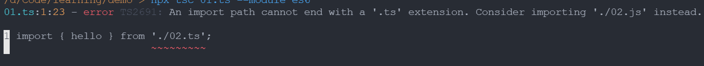
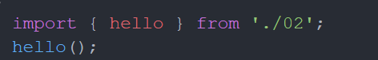
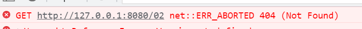
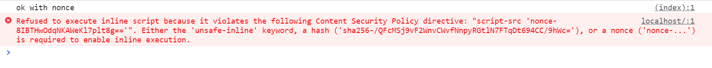
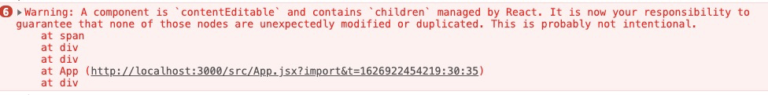

### ❓ Typescript 编译之后缺少文件后缀的问题

```js
// 01.ts
import { hello } from "./02";
hello();

// 02.ts
export function hello(): void {
  console.log("Hello World");
}
```

`import` 路径不可以是 `ts` 结尾：



但是如果忽略后缀，通过 `npx tsc 01.ts --module es6` 编译之后的文件内容中也是缺少后缀的：



那么通过浏览器打开的时候，就会报 404 错误：



没有在 Typescript 官方文档中找到可以配置项或其它解决方案，不过可以通过以下改动，避免这个问题（有点 hack 的方式）：

```ts
import { hello } from "./02.js";
```

### ❗ `CSP`（Content-Security-Policy） [🔗](https://developer.mozilla.org/en-US/docs/Web/HTTP/CSP) 的 nonce 方案

浏览器会根据页面响应头信息中的 `Content-Security-Policy` 字段中获得内容安全策略，如下例子中，要求脚本请求需要匹配 `nonce` 信息，否则浏览器就会报错：

```js
let nonce = " 8IBTHwOdqNKAWeKl7plt8g==";

res.setHeader("Content-Security-Policy", `script-src 'nonce-${nonce}';`); // 不要忽略了引号 '' 💢

res.write(`
      <script nonce="${nonce}"> console.log('ok with nonce') </script>
      <script> console.log('ok without nonce') </script>
    `);
```



### ❗ `split(1)` vs `split(1, undefined)`

`Array.prototype.splice` 的语法：

`splice(startIndex, deleteCount, item1, item2, itemN)`

如果 `deleteCount` 缺省（omitted）或者大于 `array.length - start`，则删除从开始（包含开始）到结束的全部元素，注意是缺省（omitted），如果传入的是 `undefined`，`Number(undefined)` 是 `NaN`，则不删除任何元素：

```js
[0, 1, 2, 3].splice(1); // output: [1, 2, 3]
[0, 1, 2, 3].splice(1, undefined); // output: []
```

> 使用 `in` 判断缺省还是 `undefined` ：
>
> ```js
> function fn() {
>   console.log(arguments[0] === undefined); // true 用户传了 undefined 也可能是 true
>   console.log(0 in arguments); // false 表示缺省
> }
> ```

### ❗ 获取伪元素计算样式 [🔗](https://developer.mozilla.org/en-US/docs/Web/API/Window/getComputedStyle#syntax)

`getComputedStyle` 可以传第二参数：`window.getComputedStyle(element, [pseudoElt])`
如：`window.getComputedStyle('div', '::before')`。

### ❓ 禁用右键菜单默认事件 [🔗](https://developer.mozilla.org/en-US/docs/Web/API/GlobalEventHandlers/oncontextmenu)

```js
Element.oncontextmenu = (e) => {
  e.preventDefault();
};
```

### ❓ suppressContentEditableWarning 属性 [🔗](https://zh-hans.reactjs.org/docs/dom-elements.html#suppresscontenteditablewarning)

React 中设置元素 `contentEditable` 属性为 `true` 会有以下提示，通过设置 `suppressContentEditableWarning` 为 `true` 可以去掉该提示。至于为什么会有下面提示，是因为在 React 中，React 是通过维护一个虚拟 DOM 来更新页面，任何不通过 React 的 DOM 操作，都会破坏虚拟 DOM 数据跟实际 DOM 结构的对应关系。



### ❓ Typescript `!` 后缀

Typescript 中使用 `!` 后缀，用来排除 `null` 和 `undefined` 的可能性。

```ts
const fn = (v: object) => {};
let b: object | null | undefined = null;

!b && fn(b!); // 如果不加上 `!` 后缀，ts 会告警
```

### ❗ `String.prototype.match` [🔗](https://developer.mozilla.org/en-US/docs/Web/JavaScript/Reference/Global_Objects/String/match)

`String.prototype.match` 方法要求传入的参数是一个 `RegExp` 对象，如果传入非 `RegExp` 对象，会隐式通过 `new RegExp(regexp)` 的方式进行转换：

```js
"$str".match("$str"); // false
"$str".match("\\$str"); // true
```
