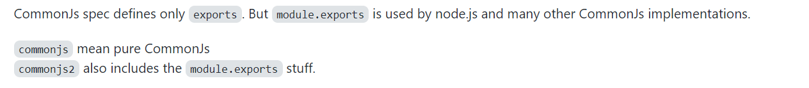
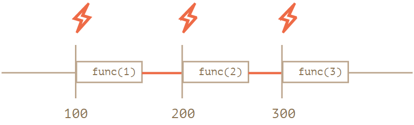
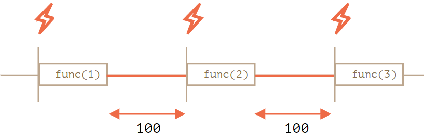

### ❔ [如何 `node` 中使用 `ES module`](<(https://nodejs.org/api/packages.html#packages_determining_module_system)>)

---

- 文件以 `mjs` 结尾
- `package.json` 文件中设置 _type_ 字段为 `"module"`

- 设置 `node` 运行参数 `--input-type=module`

### ❔ [什么是 commonjs2](https://github.com/webpack/webpack/issues/1114)

---

webpack 配置 `output.library.type` 属性支持的类型中包括 `commonjs` 和 `commonjs2`，两者的区别是：



### ❕ [React Diff 算法](https://reactjs.org/docs/reconciliation.html#motivation)

React 通过前后虚拟 DOM 树的比对，进行 DOM 的更新。一般来说，将一棵树转换到另一个树的操作，时间复杂度为 O(n^3)，React 基于下面两条假设实现了启发式的时间复杂度 O(n) 的算法：

- 两个元素类型不同生成的树也不同，即不再比较后代树节点
- 开发者可以通过设置 key 属性，来告知渲染哪些子元素在不同的渲染下可能是稳定的

React Diff 算法的比对过程：

1. 类型不同的 DOM 元素，销毁老的树，重新构建一棵新树
2. 类型相同的 DOM 元素，对比属性，更新修改过的属性
3. 类型相同的组件元素，递归 `render()` 方法返回的结果
4. 递归子元素，如果设置 `key` 属性，通过 `key` 属性来匹配

### ❕ [Render Blocking CSS](https://developers.google.com/web/fundamentals/performance/critical-rendering-path/render-blocking-css)

默认情况下，CSS 是堵塞渲染的资源，因为浏览器需要构建完 DOM 和 CSSOM 之后才能生成渲染树。可以通过媒体查询的方式让不符合查询条件的 CSS 资源变成非堵塞的。eg:

```html
<link href="style.css" rel="stylesheet" media="all" />
<link href="portrait.css" rel="stylesheet" media="orientation:portrait" />
<link href="print.css" rel="stylesheet" media="print" />
<link href="other.css" rel="stylesheet" media="(min-width: 40em)" />
```

注意，不满足媒体查询调整的 CSS 只是不在初始渲染的时候堵塞渲染，浏览器还是会在渲染结束之后继续加载资源。

### ❕ [`queueMicrotask`](https://developer.mozilla.org/en-US/docs/Web/API/HTML_DOM_API/Microtask_guide)

`queueMicrotask` 方法可以将回调 `push` 到 Microtask 中等待执行：

```js
console.log("main begin");
setTimeout(() => console.log("timeout")， 0);
queueMicrotask(() => console.log("microtask"));
console.log("main end");

// output:
// main begin
// main end
// microtask
// timeout
```

### ❕ `setTimeout` + 循环 vs `setInterval`

`setInterval` 循环定时任务可以通过`setTimeout` + 循环的方式实现类似的逻辑，区别在于 `setInterval` 任务是每隔一个 `delay` 时间执行一次，不包含任务执行时间，而 `setTimeout` 因为是每次执行完当前任务再运行一次定时任务，需要重新计时，所以多个一个任务时间。





### ❔ [同源策略](https://developer.mozilla.org/en-US/docs/Web/Security/Same-origin_policy)

什么是同源：两个 URL 的协议 + 主机 + 端口都相同，则这两个 URL 是同源。
同源策略是控制不同源之间的交互，一般来说，写和嵌入的操作是允许的，读操作是禁止的，比如

- JavaScript API 的访问：`iframe.contentWindow`，`window.open`
- `CanvasRenderingContext2D.drawImage` 不同绘制不同域的图片内容
- Web Storage 和 IndexDB 是按照同源进行隔离的，也就是限制不同源之间的读取（PS: Cookie 有单独的定义）

### ❕ [Why is typeof null “object”?](https://stackoverflow.com/questions/18808226/why-is-typeof-null-object)

JavaScript 原始类型有 7 种：

- `number`
- `string`
- `boolean`
- `symbol`
- `bigint`
- `null`
- `undefined`

虽然 `null` 是原始类型，不过` typeof null === 'object'` 这是 JavaScript 标准的一个 bug。

### ❔ [Math 中的取整 API](https://developer.mozilla.org/en-US/docs/Web/JavaScript/Reference/Global_Objects/Math)

|                       | -1.2 | -1.5 | 1.2 | 1.5 |
| --------------------- | ---- | ---- | --- | --- |
| `Math.ceil` 向上取整  | -1   | -1   | 2   | 2   |
| `Math.round` 四舍五入 | -1   | -1   | 1   | 2   |
| `Math.floor` 向下取整 | -2   | -2   | 1   | 1   |
| `Math.trunc` 截取整数 | -1   | -1   | 1   | 1   |

**😱 注意啊！-0.5 四舍五入之后是 0**

### ❕ [`new` 关键词](https://developer.mozilla.org/en-US/docs/Web/JavaScript/Reference/Operators/new#description)

关键词 `new` 会执行下面动作：

- 创建一个 blank、plain JavaScript 对象（`{}`）
- 将新创建对象实例的 `__protot__` 属性值指向构造函数的 `prototype` 对象
- 绑定新创建对象实例作为 `this` 上下文
- 返回 `this` 如果构造函数没有返回一个对象（🙃 如果返回一个原始类型数据则忽略，依然返回 `this`）

```js
function newObj(cstor, ...args) {
  const o = {};

  Object.setPrototypeOf(o, cstor.prototype);

  const returnVal = cstor.apply(o, args);

  if (returnVal instanceof Object) {
    return returnVal;
  }

  return this;
}
```
